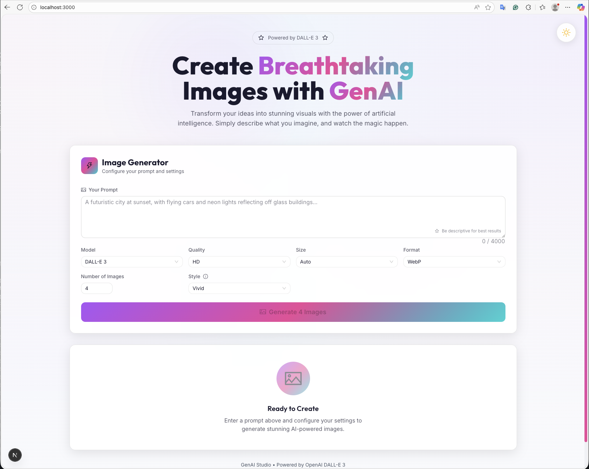
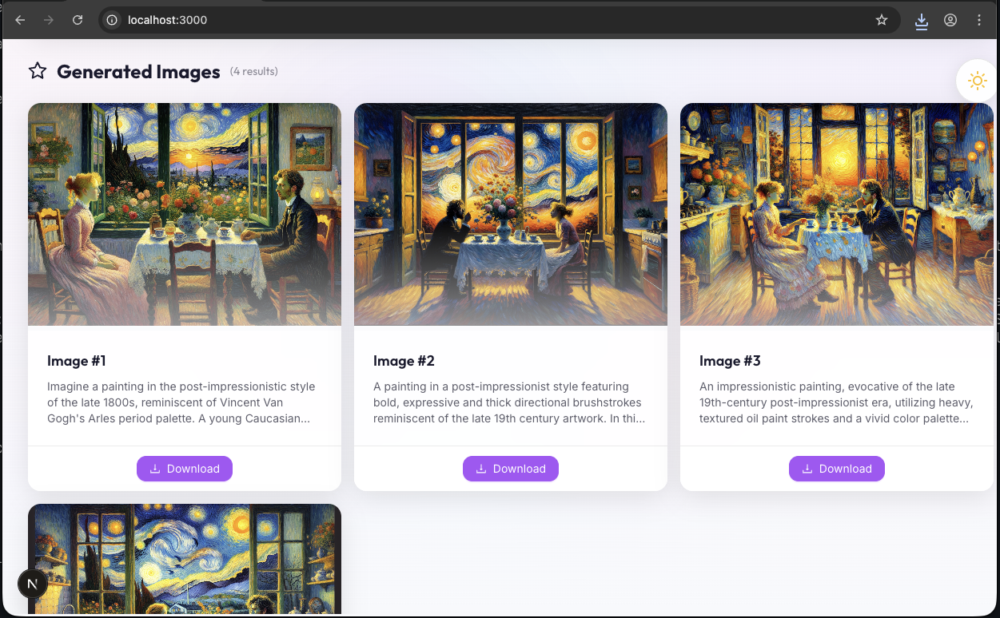

# DALL-E Web UI

### Create realistic images and art from a description in natural language.





## Requirements

- Node.js >= 24.0.0
- Create `.env` file from `.env.example` with the following variables:
  - `OPENAI_API_KEY` - Your API key (get from [OpenAI Platform](https://platform.openai.com/docs/quickstart) or [OpenRouter](https://openrouter.ai/settings/keys))
  - `OPENAI_BASE_URL` - Base URL for the API (default: `https://api.openai.com/v1`)

## Getting Started

1. Clone/Download this project

2. Install dependencies:
```bash
npm install
```

3. Create `.env` file from `.env.example` and configure your API credentials

4. Run the development server:
```bash
npm run dev
```

5. Run production server:
```bash
npm run build
npm run start
```

Open [http://localhost:3000](http://localhost:3000) with your browser to see the result.

## Usage

1. Select a model from the dropdown (DALL-E 2, DALL-E 3, or others depending on your base URL)
2. Configure generation parameters:
   - **Quality**: Standard or HD (DALL-E 3 only)
   - **Size**: Auto, 1024x1024, 1024x1536 (Portrait), or 1536x1024 (Landscape)
   - **Style**: Vivid or Natural (DALL-E 3 only)
   - **Format**: WebP, PNG, JPG, GIF, or AVIF
3. Enter your image description in the prompt field
4. Click "Generate" to create images
5. Download generated images in your selected format

Example prompt: `A sleeping cat and flower vase on the kitchen table in the artist Van Gogh style.`

## Tech Stack

- **Frontend**: Rsbuild (Rspack-based bundler) with React 19.x
- **Backend**: Express.js server with TypeScript
- **UI Library**: Ant Design 6.x with custom dark/light theming
- **Styling**: Tailwind CSS 4.x
- **Animations**: Framer Motion 12.x
- **Type Safety**: TypeScript 5.x (strict mode enabled)
- **API Client**: OpenAI SDK 6.x
- **Image Processing**: sharp 0.34.x

## Architecture

This is a **decoupled frontend/backend architecture**:

- **Frontend (Rsbuild SPA)**: Runs on port 3000, serves static files
- **Backend (Express API)**: Runs on port 3001, handles API requests

## API Endpoints

The Express server provides the following endpoints:
- `GET /api/config` - Server configuration and available models
- `POST /api/images` - Image generation via OpenAI DALL-E API
- `POST /api/download` - Image format conversion
- `GET /health` - Health check endpoint

## Docker Deployment

Build and run with Docker Compose:

```bash
docker-compose up -d --build
```

Services:
- `backend`: Express API server (port 3001)
- `frontend`: Nginx serving Rsbuild static files (port 3000)

## Developer Notes

This project uses the OpenAI official API with proper TypeScript typing and Ant Design components.

## Testing

The project includes comprehensive tests using Vitest (unit/component) and Playwright (E2E).

### Running Tests

```bash
# Run all tests (unit + component)
npm test

# Run tests in watch mode
npm run test:watch

# Run tests with coverage report
npm run test:coverage

# Run E2E tests
npm run test:e2e

# Run E2E tests in debug mode (headed browser)
npm run test:e2e:debug
```

### Test Summary

- **Total Tests**: 36 tests
- **Framework**: Vitest for unit/component, Playwright for E2E
- **Coverage Target**: 80% minimum across statements, branches, functions, and lines
- **Test Environment**: jsdom for component tests, Chromium for E2E

### Test Structure

```
src/
├── __tests__/              # General tests
├── components/__tests__/   # Component tests
├── hooks/__tests__/        # Hook tests
├── lib/api/__tests__/      # API tests
└── contexts/__tests__/     # Context tests

e2e/                        # E2E tests
├── image-generation.spec.ts
├── model-switching.spec.ts
└── theme-toggle.spec.ts
```

### Type Checking

```bash
# Run TypeScript compiler check (no emit)
npm run check

# Check frontend only
npx tsc --noEmit

# Check backend only
npx tsc --project tsconfig.server.json --noEmit
```

### Linting

```bash
# Run ESLint on all files
npm run lint

# Fix linting issues automatically
npm run lint:fix
```

### Pre-commit Hooks

The project uses Husky and lint-staged to run tests and linters on pre-commit:
- TypeScript type checking
- ESLint with auto-fix
- Staged file validation

## Scripts Reference

| Command | Description |
|---------|-------------|
| `npm run dev` | Start both backend (3001) and frontend (3000) in dev mode |
| `npm run dev:backend` | Start backend only with hot reload |
| `npm run dev:rsbuild` | Start frontend only with hot reload |
| `npm run build` | Build both backend and frontend |
| `npm run build:backend` | Compile backend TypeScript to `server/dist/` |
| `npm run build:rsbuild` | Build frontend to `dist/` |
| `npm run start` | Start both backend and frontend in production |
| `npm run start:backend` | Start backend from `server/dist/` |
| `npm run start:rsbuild` | Preview frontend build |
| `npm test` | Run all unit and component tests |
| `npm run test:watch` | Run tests in watch mode |
| `npm run test:coverage` | Run tests with coverage report |
| `npm run test:e2e` | Run E2E tests with Playwright |
| `npm run check` | Run TypeScript type checking |
| `npm run lint` | Run ESLint on all files |
| `npm run lint:fix` | Fix ESLint issues automatically |

